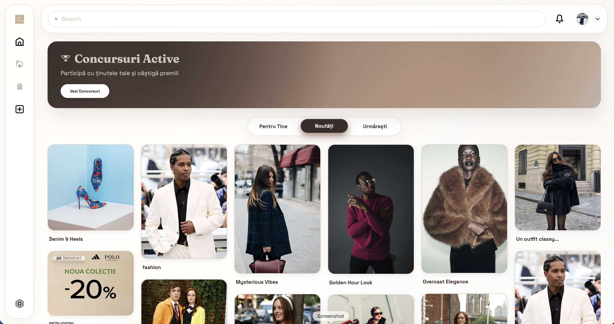
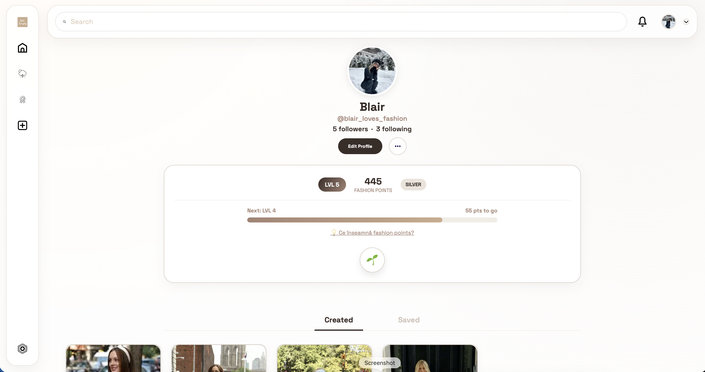

# ChicEveryday 👗🌦️

**Style meets Utility.** A social platform for fashion enthusiasts that combines outfit inspiration with real-time weather recommendations and gamified engagement.

## 🎓 Academic Context

This project was developed at the **University of Bucharest**, **Faculty of Mathematics and Computer Science (FMI)**.  
It serves as the final project for the **Software Engineering** course, **Information Technology (CTI)** specialization, 4th Year, 1st Semester.

## 📖 About the Project

**ChicEveryday** helps users answer the daily question: *"What should I wear today?"*. 
It is a MERN Full-Stack web application designed to connect fashion lovers, content creators, and shops. Unlike standard social networks, ChicEveryday focuses purely on fashion, offering utility through weather-based suggestions and keeping users engaged through a robust gamification system.

### Key Objectives
* **Inspiration:** A dedicated space for sharing and discovering outfits.
* **Utility:** Smart suggestions based on local weather conditions and/or users' personal preferences.
* **Engagement:** A dynamic community driven by contests and a progression system.
* **Brand Growth:** A unique brand promotion system that lets shops closely interact with their customer base.

## 📸 Screenshots
| Main Feed | User Profile & Gamification |
|:---:|:---:|
|  |  |
| *Discover trends & interact* | *Track progress & earn badges* |

## ✨ Key Features

### 👤 For Users
* **Social Interaction:** Create posts with images, like, comment, report, and save outfits to personal collections (Boards).
* **Gamification System:** Earn **Fashion Points**, level up (e.g., reach *Diamond* status), and unlock unique **Badges** and perks based on activity.
* **Weather Integration:** Get outfit recommendations adapted to real-time weather conditions via OpenWeatherMap.
* **Follow System:** Follow favorite creators to build a personalized feed.
* **Infinite Feed:** Continuous navigation through outfits using a modern Masonry layout.

### 🛍️ For Shops
* **Verified Accounts:** Dedicated onboarding process with document validation.
* **Contests:** Organize fashion contests where users can submit outfit photos directly in the comments.
* **Product Promotion:** Add external links to purchasable items.
* **Paid Promotions:** Make your posts more visible in users' feeds for a small fee.

### 🛡️ Administration
* **Moderation:** Tools to manage users, posts, and validate shop documents.

## 🛠️ Tech Stack

**Frontend:**
*  **React 19** - Main UI library.
*  **Vite** - Fast build tool.
*  **React Router v7** - Advanced routing.

### State Management & Data Fetching
* 🐻 **Zustand** - Global state management (lightweight and performant).
* 🔄 **TanStack Query (React Query)** - Server state management, caching, and data synchronization.
* 📡 **Axios** - HTTP client for API requests.

### UI/UX & Gamification Libraries
* **CSS/SCSS** for custom styling.
* 🧱 **React Masonry CSS** - Dynamic Pinterest-style layout for the outfit feed.
* 📜 **React Infinite Scroll** - Continuous loading of posts (Pagination).
* 🎉 **React Confetti** - Visual feedback for the gamification system (Level Up).
* 🎨 **React Colorful** - Color picker for customization.
* 😄 **Emoji Picker React** - Support for expressive reactions and comments.
* ☁️ **ImageKit React** - Image optimization and delivery.
* ⏳ **Timeago.js** - Relative time formatting (e.g., "2 hours ago").

**Backend:**
* 
* 

**Database:**
*  (Mongoose ODM)

**External Services:**
* ☁️ **ImageKit:** For optimized image storage and delivery.
* ☀️ **OpenWeatherMap API:** For real-time weather data integration.

## 🚀 Getting Started

Follow these steps to set up the project locally.

### Prerequisites
* Node.js (v14 or higher)
* MongoDB (Local or Atlas)
* Git
* Make sure you create your MongoDB, ImageKit, and OpenWeatherMap accounts beforehand.

### Installation

1.  **Clone the repository**
    ```bash
    git clone [https://github.com/carolinacostache/chiceveryday.git](https://github.com/carolinacostache/chiceveryday.git)
    cd chiceveryday
    ```

2.  **Install Dependencies (Backend)**
    ```bash
    cd backend
    npm install
    ```
    **Configuration:** Create a `.env` file in the `backend` folder with the following keys:
    ```env
    MONGO_URL=your_mongodb_connection_string
    CLIENT_URL=http://localhost:5173
    PORT=3000
    JWT_SECRET=your_jwt_secret_key
    IK_PUBLIC_KEY=your_public_key
    IK_PRIVATE_KEY=your_private_key
    IK_URL_ENDPOINT=your_imagekit_profile_link
    ```

3.  **Install Dependencies (Frontend)**
    ```bash
    cd client
    npm install
    ```

    **Configuration:** Create a `.env` file in the `client` folder. Since we are using **Vite**, variables must start with `VITE_`:
    ```env
    VITE_URL_IK_ENDPOINT=your_imagekit_profile_link
    VITE_API_ENDPOINT=http://localhost:3000
    VITE_OPENWEATHER_API_KEY=your_openweather_api_key
    ```

4.  **Run the App**
    * Backend: `cd backend && npm run dev`
    * Frontend: `cd client && npm run dev`

## 👏 Credits & Acknowledgments

* **Baseline:** This project uses a template by **Safak (Lama Dev)** as a baseline, which we significantly extended and customized to fit our specific requirements (Gamification, Weather API, Shop Roles).
* **Research:** Features are based on market research (McKinsey, Met Office) regarding fashion personalization and weather influence.

## 👥 The Team (Team 22)

**Developers:**
* **Costache Carolina-Andreea**
* **Ştefan Octavia-Elena** !(https://github.com/octaviastefan)
* **Brînzea Mălina Alexandra** !(https://github.com/malinaalx)

**Scrum Masters:**
* Radulescu Alexia-Bianca
* Ionescu Andreea-Raluca
* Gheorghe Cosmina

---

Made with ❤️ and lots of coffee.